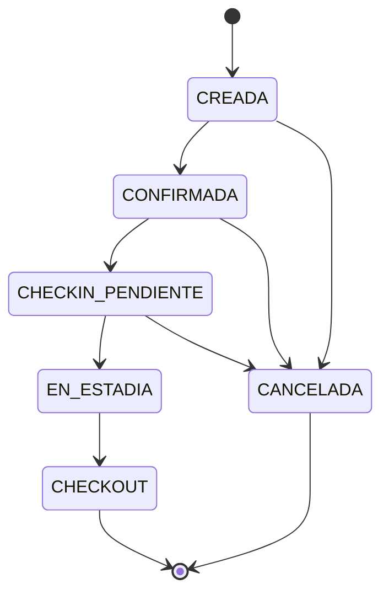

# ms-andesstay-reservations

Microservicio de reservas de AndesStay. Gestiona el ciclo de vida de una reserva (creación, edición, cambios de estado y eliminación) y se coordina con `ms-andesstay-catalog` para asignar y liberar unidades.

- **Puerto por defecto:** 8081
- **Stack:** Java 17, Spring Boot 3.4, Spring Data JPA, PostgreSQL (AWS RDS)
- **Tabla:** `as_reservations` (la crea Hibernate con `ddl-auto: update`, solo para demostración)
- **Acceso:** es un servicio interno. Solo debe ser accesible dentro de la red privada y no debe exponerse directamente a internet.

## Autenticación interna

Todas las rutas exigen el header `X-Internal-Token` con el valor de la variable `INTERNAL_TOKEN`. Sin el header, o con un valor distinto, el servicio responde `401`.

Este servicio también envía ese header a catalog, por lo que **ambos servicios deben usar el mismo token**.

## Configuración

| Variable | Obligatoria | Por defecto | Descripción |
|---|---|---|---|
| `RESERVATIONS_DB_PASSWORD` | Sí | (vacío) | Contraseña de la base de datos |
| `INTERNAL_TOKEN` | Sí | (vacío) | Token compartido entre servicios. Si falta, la app no arranca |
| `RESERVATIONS_DB_USER` | No | `postgres` | Usuario de la base |
| `DB_URL` | No | URL de la base `andesstay` en RDS | Cadena de conexión JDBC |
| `CATALOG_URL` | No | `http://localhost:8082` | Dirección de catalog |
| `PORT` | No | `8081` | Puerto HTTP |

La contraseña y el token no se guardan en el repositorio: se definen como variables de entorno.

## Cómo ejecutarlo

```powershell
$env:RESERVATIONS_DB_PASSWORD="<contraseña>"
$env:INTERNAL_TOKEN="<token compartido>"
mvn spring-boot:run
```

Pruebas automáticas:

```powershell
mvn test
```

Para reservar y confirmar hace falta que catalog esté corriendo en `CATALOG_URL`.

## Modelo de reserva

```json
{
  "id": "b338054e-a2d4-4603-972f-db50b489eafc",
  "guestId": "huesped-1",
  "unitId": "c61709c9-c1f7-4eff-aebb-85c91b2537e8",
  "checkIn": "2026-10-10",
  "checkOut": "2026-10-15",
  "status": "CREADA",
  "createdAt": "2026-09-24T05:25:44.189740Z"
}
```

## Endpoints

Base: `/api/reservations`

| Método | Ruta | Cuerpo | Respuesta |
|---|---|---|---|
| GET | `/api/reservations` | no lleva. Filtro opcional `?guestId=` | `200` lista de reservas, de la más reciente a la más antigua |
| GET | `/api/reservations/{id}` | no lleva | `200` la reserva. `404` si no existe |
| POST | `/api/reservations` | `guestId`, `unitId`, `checkIn`, `checkOut` | `201` reserva en estado `CREADA`. `400` si los datos son inválidos |
| PUT | `/api/reservations/{id}` | `unitId`, `checkIn`, `checkOut` | `200` reserva actualizada. `409` si no está en `CREADA`. `404` si no existe |
| DELETE | `/api/reservations/{id}` | no lleva | `204`. `409` si no está en `CREADA` ni `CANCELADA`. `404` si no existe |
| PATCH | `/api/reservations/{id}/status` | `{ "status": "<ESTADO>" }` | `200` reserva con el nuevo estado. `409` si la transición no es válida |

Fechas en formato `AAAA-MM-DD`. La salida (`checkOut`) debe ser posterior a la entrada (`checkIn`), o el servicio responde `400`.

## Estados y transiciones

Estados: `CREADA`, `CONFIRMADA`, `CHECKIN_PENDIENTE`, `EN_ESTADIA`, `CHECKOUT`, `CANCELADA`.



`CHECKOUT` y `CANCELADA` son estados finales. Desde `EN_ESTADIA` no se puede cancelar.

### Efecto sobre el catálogo

| Transición | Llamada a catalog |
|---|---|
| `CREADA → CONFIRMADA` | `POST /internal/allocations`: asigna la unidad en esas fechas |
| `EN_ESTADIA → CHECKOUT` | `DELETE /internal/allocations/{id}`: libera la unidad |
| `CONFIRMADA → CANCELADA` o `CHECKIN_PENDIENTE → CANCELADA` | `DELETE /internal/allocations/{id}`: libera la unidad |
| `CREADA → CANCELADA` | ninguna (la unidad nunca se asignó) |

Crear una reserva **no** valida la disponibilidad ni que la unidad exista. Esa validación ocurre al confirmar. Si falla el guardado local después de llamar a catalog, el servicio intenta compensar la operación, pero esto no reemplaza una transacción distribuida.

## Códigos de error

| Código | Cuándo |
|---|---|
| `400` | Datos inválidos o salida no posterior a la entrada |
| `401` | Falta el header `X-Internal-Token` o es incorrecto |
| `404` | La reserva no existe (o catalog no encuentra la unidad al confirmar) |
| `409` | Edición fuera de `CREADA`, eliminación sin cancelar, transición inválida, o unidad ocupada al confirmar |
| `503` | Catalog no está disponible |

El cuerpo de las respuestas de error incluye `status` y `error` (por ejemplo `Conflict`), pero no el mensaje detallado.

## Pruebas manuales realizadas (reglas de negocio)

Con ambos servicios corriendo contra la misma base y una unidad de prueba:

| Prueba | Resultado |
|---|---|
| Crear dos reservas para la misma unidad con fechas que se superponen | `201` las dos |
| Confirmar la primera | `200`, estado `CONFIRMADA` |
| Confirmar la segunda (unidad ocupada) | `409` |
| Transición inválida `CREADA → EN_ESTADIA` | `409` |
| Editar una reserva `CONFIRMADA` | `409` |
| Eliminar una reserva `CONFIRMADA` sin cancelar | `409` |
| Cancelar la reserva confirmada | `200`, estado `CANCELADA` |
| Consultar disponibilidad de la unidad tras cancelar | `{"available": true}` |
| Confirmar la segunda reserva tras la cancelación | `200`, estado `CONFIRMADA` |
